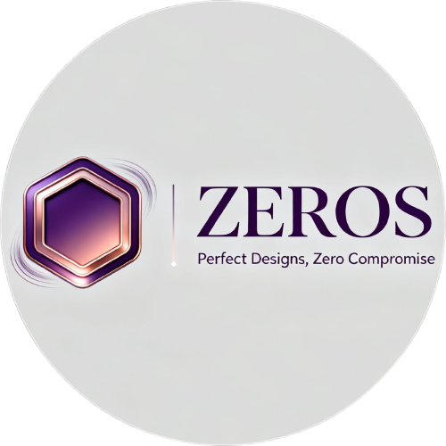
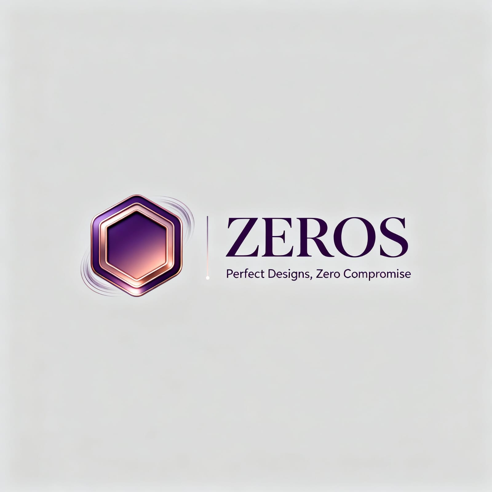

<!-- ZEROS Creative Agency README -->

<div align="center">
  
  
  
  <h1 style="color:#6a0dad; font-size: 3rem; font-weight: 800; margin: 20px 0;">
    ZEROS CREATIVE AGENCY
  </h1>
  
  <p style="font-size: 1.2rem; max-width: 600px; margin: 0 auto 30px;">
    Modern, Animated, and Responsive Web Template for Agencies & Creatives
  </p>
  
  
  
</div>

---

## 🌟 OVERVIEW

<div style="background: linear-gradient(135deg, #6a0dad20 0%, #1a1a1a 100%); padding: 20px; border-radius: 10px; border-left: 4px solid #6a0dad;">
  <p style="font-size: 1.1rem; line-height: 1.6;">
    <strong>ZEROS</strong> is a cutting-edge, visually stunning website template built with <strong>HTML5</strong>, <strong>CSS3</strong>, <strong>GSAP</strong>, and <strong>JavaScript</strong>. Designed for creative agencies, freelancers, and digital studios who demand exceptional aesthetics, smooth animations, and a professional online presence that stands out in today's competitive digital landscape.
  </p>
</div>

---

## ✨ KEY FEATURES

<div style="display: grid; grid-template-columns: repeat(auto-fit, minmax(300px, 1fr)); gap: 20px; margin: 25px 0;">
  <div style="background: #1a1a1a; padding: 20px; border-radius: 10px; border: 1px solid #333;">
    <h3 style="color: #6a0dad; margin-top: 0;">🎨 VISUAL EXCELLENCE</h3>
    <ul style="list-style: none; padding: 0;">
      <li>✓ Animated Hero Sections with GSAP</li>
      <li>✓ Infinite Marquee Scrolling</li>
      <li>✓ Typewriter Text Effects</li>
      <li>✓ Micro-interactions & Hover Effects</li>
    </ul>
  </div>
  
  <div style="background: #1a1a1a; padding: 20px; border-radius: 10px; border: 1px solid #333;">
    <h3 style="color: #6a0dad; margin-top: 0;">📱 RESPONSIVE DESIGN</h3>
    <ul style="list-style: none; padding: 0;">
      <li>✓ Mobile-First Approach</li>
      <li>✓ Mobile Navigation Menu</li>
      <li>✓ Flexible Grid Layouts</li>
      <li>✓ Cross-Device Compatibility</li>
    </ul>
  </div>
  
  <div style="background: #1a1a1a; padding: 20px; border-radius: 10px; border: 1px solid #333;">
    <h3 style="color: #6a0dad; margin-top: 0;">🚀 FUNCTIONALITY</h3>
    <ul style="list-style: none; padding: 0;">
      <li>✓ Pricing with Currency Toggle (INR/USD)</li>
      <li>✓ Client Intake Form with Data Handling</li>
      <li>✓ Project Portfolio Showcase</li>
      <li>✓ Session-based Countdown Timer</li>
    </ul>
  </div>
</div>

---

## 🛠️ TECHNOLOGY STACK

<div align="center" style="margin: 30px 0;">
  
  
  
  
</div>

---

## 🗂️ PROJECT STRUCTURE

<div style="background: #121212; padding: 20px; border-radius: 10px; font-family: 'Courier New', monospace; margin: 25px 0;">
Company/<br>
├── About.html         <span style="color: #6a0dad;"># About the agency with typewriter animation</span><br>
├── Brand.jpg          <span style="color: #6a0dad;"># Brand image</span><br>
├── Contact.html       <span style="color: #6a0dad;"># Enhanced contact form with data handling</span><br>
├── favicon.ico        <span style="color: #6a0dad;"># Favicon</span><br>
├── index.html         <span style="color: #6a0dad;"># Main landing page with typewriter effect</span><br>
├── logo.svg           <span style="color: #6a0dad;"># Agency logo</span><br>
├── project1.png       <span style="color: #6a0dad;"># Project showcase images</span><br>
├── project2.png<br>
├── project3.png<br>
├── projects.html      <span style="color: #6a0dad;"># Portfolio/projects page</span><br>
├── Purchase.html      <span style="color: #6a0dad;"># Purchase/offer page</span><br>
├── services.html      <span style="color: #6a0dad;"># Services page with animations</span><br>
├── save_contact_data.php <span style="color: #6a0dad;"># Server-side form handler</span><br>
├── script.js          <span style="color: #6a0dad;"># Enhanced animations and interactions</span><br>
├── style.css          <span style="color: #6a0dad;"># Main stylesheet</span><br>
├── purchase-styles.css <span style="color: #6a0dad;"># Additional styles for Purchase page</span><br>
└── .hintrc            <span style="color: #6a0dad;"># Linting config</span>
</div>

---

## 🎬 VISUAL SHOWCASE

<div align="center" style="margin: 30px 0;">
  <div style="display: flex; justify-content: center; gap: 20px; flex-wrap: wrap;">
    <div>
      
      <p style="text-align: center; margin-top: 10px; color: #6a0dad;">Project Showcase</p>
    </div>
    <div>
      
      <p style="text-align: center; margin-top: 10px; color: #6a0dad;">Interactive Portfolio</p>
    </div>
  </div>
</div>

---

## 🚀 GETTING STARTED

### Quick Setup
```bash
# Clone the repository
git clone https://github.com/Satish-Chaudhary/creative-agency-zeros.git

# Navigate to the project directory
cd Company

# Open index.html in your browser
```

### Contact Form Functionality
To enable full contact form functionality:
1. Deploy to a web server with PHP support
2. Or set up a local development environment (XAMPP, WAMP, etc.)

---

## 🎨 CUSTOMIZATION OPTIONS

<div style="display: grid; grid-template-columns: repeat(auto-fit, minmax(250px, 1fr)); gap: 15px; margin: 25px 0;">
  <div style="background: #1a1a1a; padding: 15px; border-radius: 8px;">
    <h4 style="color: #6a0dad; margin-top: 0;">🎨 DESIGN</h4>
    <p>Modify <code>style.css</code> and <code>purchase-styles.css</code> for custom styling</p>
  </div>
  
  <div style="background: #1a1a1a; padding: 15px; border-radius: 8px;">
    <h4 style="color: #6a0dad; margin-top: 0;">📄 CONTENT</h4>
    <p>Edit HTML files to update content and branding</p>
  </div>
  
  <div style="background: #1a1a1a; padding: 15px; border-radius: 8px;">
    <h4 style="color: #6a0dad; margin-top: 0;">⚡ ANIMATIONS</h4>
    <p>Adjust GSAP animations in <code>script.js</code></p>
  </div>
  
  <div style="background: #1a1a1a; padding: 15px; border-radius: 8px;">
    <h4 style="color: #6a0dad; margin-top: 0;">💰 PRICING</h4>
    <p>Customize pricing in <code>Purchase.html</code> and <code>index.html</code></p>
  </div>
</div>

---

## 🔧 RECENT ENHANCEMENTS

<div style="background: #1a1a1a; padding: 25px; border-radius: 10px; border-left: 4px solid #6a0dad; margin: 25px 0;">
  <h3 style="color: #6a0dad; margin-top: 0;">Latest Improvements</h3>
  <ul style="list-style: none; padding: 0;">
    <li style="margin: 10px 0; padding-left: 20px; border-left: 2px solid #6a0dad;">
      <strong>Pricing Section:</strong> Added currency toggle functionality (INR/USD)
    </li>
    <li style="margin: 10px 0; padding-left: 20px; border-left: 2px solid #6a0dad;">
      <strong>Mobile Navigation:</strong> Implemented responsive mobile menu
    </li>
    <li style="margin: 10px 0; padding-left: 20px; border-left: 2px solid #6a0dad;">
      <strong>Consistent UI:</strong> Added uniform header and footer across all pages
    </li>
    <li style="margin: 10px 0; padding-left: 20px; border-left: 2px solid #6a0dad;">
      <strong>Purchase Page:</strong> Enhanced with new sections and modern design
    </li>
    <li style="margin: 10px 0; padding-left: 20px; border-left: 2px solid #6a0dad;">
      <strong>Project Showcase:</strong> Improved with filtering and carousel navigation
    </li>
    <li style="margin: 10px 0; padding-left: 20px; border-left: 2px solid #6a0dad;">
      <strong>Performance:</strong> Optimized JavaScript for better user experience
    </li>
  </ul>
</div>

---

## 🤝 CONTRIBUTING

<div style="background: #1a1a1a; padding: 20px; border-radius: 10px; text-align: center; margin: 25px 0;">
  <h3 style="color: #6a0dad;">We Welcome Contributions!</h3>
  <p>Pull requests are encouraged. For major changes, please open an issue first to discuss your ideas.</p>
  <div style="margin-top: 15px;">
    
    
  </div>
</div>

---

## 📧 CONTACT

<div align="center" style="margin: 30px 0;">
  <div style="background: linear-gradient(135deg, #6a0dad30 0%, #1a1a1a 100%); padding: 30px; border-radius: 15px; max-width: 600px; margin: 0 auto;">
    <h3 style="color: #6a0dad; margin-top: 0;">Have Questions or Freelance Inquiries?</h3>
    <p style="font-size: 1.2rem; margin: 20px 0;">
      <strong>zeros.studio19@gmail.com</strong>
    </p>
    <a href="mailto:zeros.studio19@gmail.com" style="background: #6a0dad; color: white; padding: 12px 25px; text-decoration: none; border-radius: 30px; font-weight: bold; display: inline-block;">
      Send Email
    </a>
  </div>
</div>

---

<div align="center">
  
  <br><br>
  <p style="font-style: italic; color: #aaa;">
    © 2025 ZEROS Creative Agency. All rights reserved.
  </p>
</div>