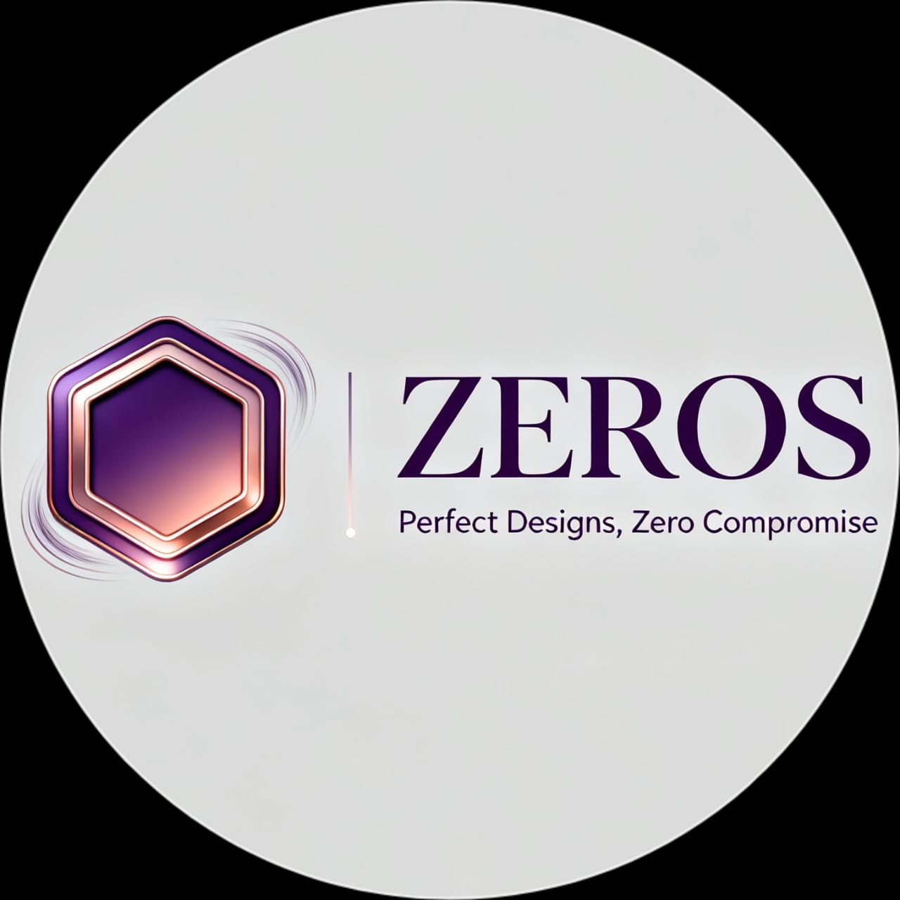
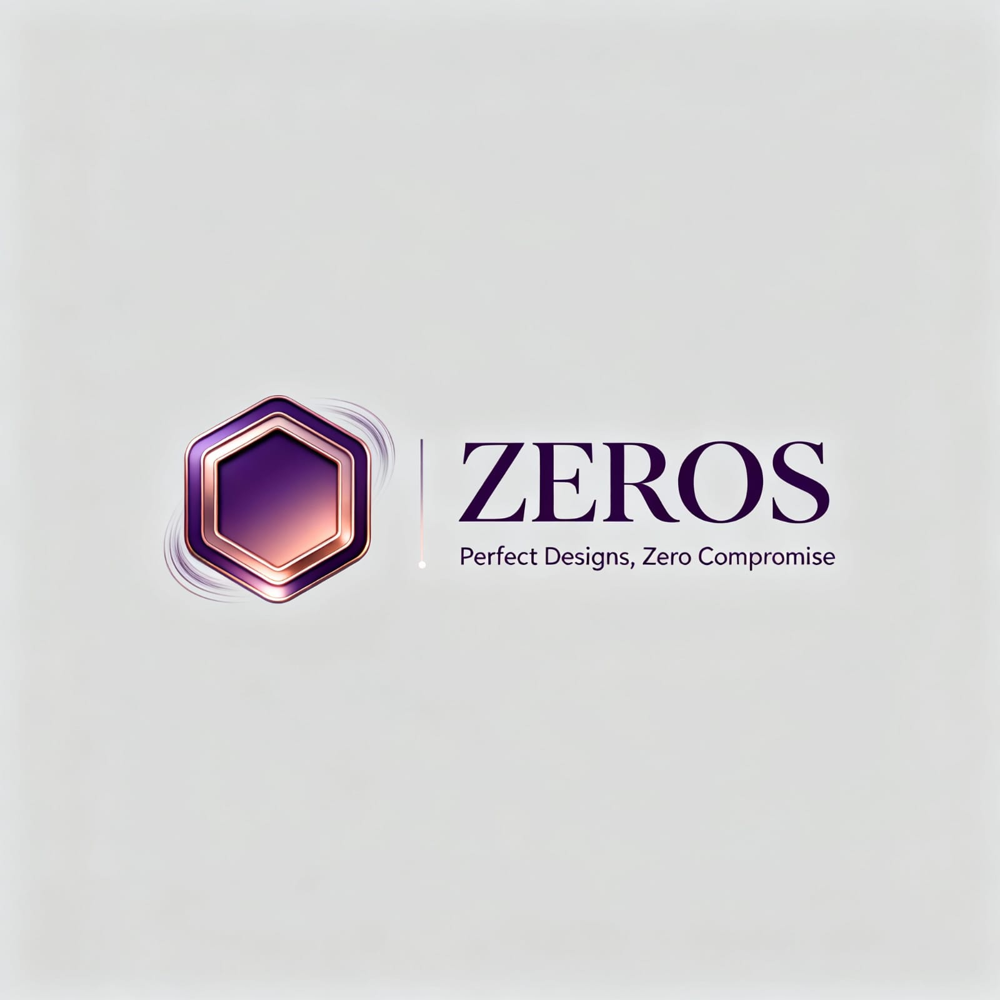

<!-- ZEROS Creative Agency README -->

<h1 align="center">
   <br/>
  <span style="color:#6a0dad;">ZEROS Creative Agency</span>
</h1>

<p align="center">
  <b>Modern, Animated, and Responsive Web Template for Agencies & Creatives</b><br>
  
</p>

---

## ✨ Overview
ZEROS is a visually stunning, interactive, and fully responsive website template built with <b>HTML5</b>, <b>CSS3</b>, <b>GSAP</b>, and <b>JavaScript</b>. Perfect for creative agencies, freelancers, and digital studios who want to stand out with bold visuals, smooth animations, and a professional online presence.

---

## 🚀 Features

- <b>Animated Hero Section</b> with GSAP
- <b>Session-based Countdown Timer</b> (JS + sessionStorage)
- <b>Infinite Marquee</b> (GSAP-powered)
- <b>Responsive Design</b> (CSS3 Flex & Grid)
- <b>Modern UI/UX</b> with micro-interactions
- <b>Project Portfolio & About Pages</b>
- <b>Contact Form</b> (HTML/CSS)
- <b>Easy Customization</b> (HTML, CSS, JS)

---

## 🖥️ Tech Stack

|  |  |  |  |
|---|---|---|---|

---

## 📂 Folder Structure

```text
Company/
├── About.html         # About the agency
├── Brand.jpg          # Brand image
├── Contact.html       # Contact form and info
├── favicon.ico        # Favicon
├── getStarted.html    # Get Started/Contact CTA
├── landing2.html      # Main landing page
├── logo.svg           # Agency logo
├── project1.png       # Project showcase images
├── project2.png
├── project3.png
├── projects.html      # Portfolio/projects page
├── Purchase.html      # Purchase/offer page
└── .hintrc            # Linting config
```

---

## 🎬 Visual Interactions

- <b>GSAP Animations:</b> Smooth entrance, scroll, and hover effects
- <b>Countdown Timer:</b> Persists on reload, triggers offer changes
- <b>Marquee:</b> Infinite, seamless brand message scroll
- <b>Micro-interactions:</b> Button, nav, and card hover effects

<p align="center">
  
  
</p>

---

## 🛠️ Getting Started

1. <b>Clone the repository:</b>
   <pre>git clone https://github.com/Satish-Chaudhary/creative-agency-zeros.git</pre>
2. <b>Open the <code>Company</code> folder in your code editor.</b>
3. <b>Open <code>landing2.html</code> in your browser to view the site.</b>

---

## 🎨 Customization
- Replace images (<code>project1.png</code>, <code>logo.svg</code>, etc.) with your own.
- Edit HTML files to update content, links, and branding.
- Tweak styles in the <code>&lt;style&gt;</code> tags or add a <code>style.css</code> for more customization.
- Adjust GSAP animations in the JS for unique effects.

---

## 🤝 Contributing
Pull requests are welcome! For major changes, please open an issue first to discuss what you would like to change.

---

## 📧 Contact
For questions or freelance inquiries, email: <b>info@zerosagency.com</b>

---

<p align="center">
  
  <br>
  <i>© 2025 ZEROS Creative Agency. All rights reserved.</i>
</p>
