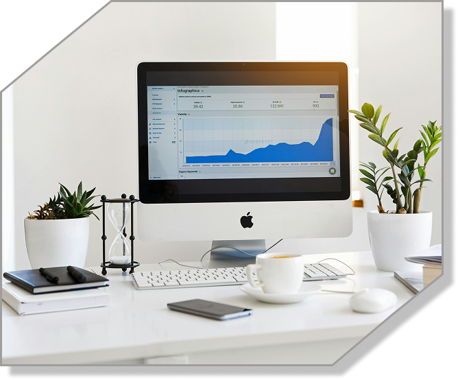

<!-- ZEROS Creative Agency README -->

  
  <h1 style="color:#6a0dad; font-size: 3rem; font-weight: 800; margin: 20px 0;">
    ZEROS CREATIVE AGENCY
  </h1>
  
  

    Modern, Animated, and Responsive Web Template for Creative Agencies
  

  
  
  
  

    
    
    
    
  

---

## 🌟 OVERVIEW

  

    <strong>ZEROS</strong> is a cutting-edge, visually stunning website template built with <strong>HTML5</strong>, <strong>CSS3</strong>, <strong>GSAP</strong>, and <strong>JavaScript</strong>. Designed for creative agencies, freelancers, and digital studios who demand exceptional aesthetics, smooth animations, and a professional online presence that stands out in today's competitive digital landscape.
  

  

    This template combines modern design principles with powerful animation capabilities to create an immersive user experience that captures attention and drives engagement. With responsive design and cross-browser compatibility, ZEROS ensures your creative work looks stunning on any device.
  

---

## ✨ KEY FEATURES

  

    <h3 style="color: #6a0dad; margin-top: 0; font-size: 1.4rem;">🎨 VISUAL EXCELLENCE</h3>
    <ul style="list-style: none; padding: 0;">
      <li style="margin: 12px 0; padding-left: 25px; position: relative;">✓ Animated Hero Sections with GSAP</li>
      <li style="margin: 12px 0; padding-left: 25px; position: relative;">✓ Infinite Marquee Scrolling</li>
      <li style="margin: 12px 0; padding-left: 25px; position: relative;">✓ Typewriter Text Effects</li>
      <li style="margin: 12px 0; padding-left: 25px; position: relative;">✓ Micro-interactions & Hover Effects</li>
    </ul>
  

  
  

    <h3 style="color: #6a0dad; margin-top: 0; font-size: 1.4rem;">📱 RESPONSIVE DESIGN</h3>
    <ul style="list-style: none; padding: 0;">
      <li style="margin: 12px 0; padding-left: 25px; position: relative;">✓ Mobile-First Approach</li>
      <li style="margin: 12px 0; padding-left: 25px; position: relative;">✓ Mobile Navigation Menu</li>
      <li style="margin: 12px 0; padding-left: 25px; position: relative;">✓ Flexible Grid Layouts</li>
      <li style="margin: 12px 0; padding-left: 25px; position: relative;">✓ Cross-Device Compatibility</li>
    </ul>
  

  
  

    <h3 style="color: #6a0dad; margin-top: 0; font-size: 1.4rem;">🚀 FUNCTIONALITY</h3>
    <ul style="list-style: none; padding: 0;">
      <li style="margin: 12px 0; padding-left: 25px; position: relative;">✓ Pricing with Currency Toggle (INR/USD)</li>
      <li style="margin: 12px 0; padding-left: 25px; position: relative;">✓ Client Intake Form with Data Handling</li>
      <li style="margin: 12px 0; padding-left: 25px; position: relative;">✓ Project Portfolio Showcase</li>
      <li style="margin: 12px 0; padding-left: 25px; position: relative;">✓ Session-based Countdown Timer</li>
    </ul>
  

---

## 🛠️ TECHNOLOGY STACK

  
  
  
  

  <h3 style="color: #6a0dad; margin-top: 0;">Why These Technologies?</h3>
  <ul style="display: grid; grid-template-columns: repeat(auto-fit, minmax(250px, 1fr)); gap: 15px; list-style: none; padding: 0;">
    <li style="padding: 10px; background: #222; border-radius: 5px;">🔹 <strong>HTML5</strong> - Semantic markup for better SEO and accessibility</li>
    <li style="padding: 10px; background: #222; border-radius: 5px;">🔹 <strong>CSS3</strong> - Advanced styling and animations</li>
    <li style="padding: 10px; background: #222; border-radius: 5px;">🔹 <strong>JavaScript</strong> - Interactive and dynamic user experiences</li>
    <li style="padding: 10px; background: #222; border-radius: 5px;">🔹 <strong>GSAP</strong> - High-performance animations and transitions</li>
  </ul>

---

## 🗂️ PROJECT STRUCTURE

creative-agency-zeros/ 
├── about.html         # About the agency with typewriter animation 
├── contact.html       # Enhanced contact form with data handling 
├── index.html         # Main landing page with typewriter effect 
├── projects.html      # Portfolio/projects page 
├── Purchase.html      # Purchase/offer page 
├── services.html      # Services page with animations 
├── favicon.ico        # Favicon 
├── .hintrc            # Linting config 
├── assets/ 
│   ├── css/ 
│   │   ├── style.css          # Main stylesheet 
│   │   ├── about-style.css    # Styles for about page 
│   │   ├── contact.css        # Styles for contact page 
│   │   ├── projects-styles.css# Styles for projects page 
│   │   └── purchase-styles.css# Styles for purchase page 
│   ├── images/ 
│   │   ├── logo.svg           # Agency logo 
│   │   ├── Brand.jpg          # Brand image 
│   │   ├── project1.png       # Project showcase images 
│   │   ├── project2.png 
│   │   ├── project3.png 
│   │   └── [other images] 
│   └── js/ 
│       ├── script.js          # Main scripts and animations 
│       ├── about.js           # Scripts for about page 
│       ├── contact.js         # Scripts for contact page 
│       ├── projects.js        # Scripts for projects page 
│       ├── purchase.js        # Scripts for purchase page 
│       └── services.js        # Scripts for services page 

---

## 🎬 VISUAL SHOWCASE

  

    

      
      
Project Showcase

    

    

      
      
Interactive Portfolio

    

  

---

## 🚀 GET STARTED TODAY

  <h3 style="color: #fff; font-size: 2rem; margin-top: 0;">Ready to Elevate Your Online Presence?</h3>
  

    Clone the repository and start building your stunning creative agency website today.
  

  

    <a href="https://github.com/Satish-Chaudhary/creative-agency-zeros" style="background: #6a0dad; color: white; padding: 15px 30px; text-decoration: none; border-radius: 30px; font-weight: bold; display: inline-block; margin: 0 10px; transition: background 0.3s ease, transform 0.2s ease;">
      View on GitHub
    </a>
    <a href="#" style="background: #fff; color: #6a0dad; padding: 15px 30px; text-decoration: none; border-radius: 30px; font-weight: bold; display: inline-block; margin: 0 10px; transition: background 0.3s ease, transform 0.2s ease;">
      Download ZIP
    </a>
  

---

## 🎨 CUSTOMIZATION OPTIONS

  

    <h4 style="color: #6a0dad; margin-top: 0;">🎨 DESIGN</h4>
    
Modify stylesheets in <code>assets/css/</code> for custom styling

  

  
  

    <h4 style="color: #6a0dad; margin-top: 0;">📄 CONTENT</h4>
    
Edit HTML files to update content and branding

  

  
  

    <h4 style="color: #6a0dad; margin-top: 0;">⚡ ANIMATIONS</h4>
    
Adjust GSAP animations in <code>assets/js/script.js</code>

  

  
  

    <h4 style="color: #6a0dad; margin-top: 0;">💰 PRICING</h4>
    
Customize pricing in <code>Purchase.html</code> and <code>index.html</code>

  

---

## 🔧 RECENT ENHANCEMENTS

  <h3 style="color: #6a0dad; margin-top: 0;">Latest Improvements</h3>
  <ul style="list-style: none; padding: 0;">
    <li style="margin: 15px 0; padding: 15px; background: #222; border-radius: 8px; display: flex; align-items: center;">
      ✓
      

        <strong>Pricing Section:</strong> Added currency toggle functionality (INR/USD)
      

    </li>
    <li style="margin: 15px 0; padding: 15px; background: #222; border-radius: 8px; display: flex; align-items: center;">
      ✓
      

        <strong>Mobile Navigation:</strong> Implemented responsive mobile menu
      

    </li>
    <li style="margin: 15px 0; padding: 15px; background: #222; border-radius: 8px; display: flex; align-items: center;">
      ✓
      

        <strong>Consistent UI:</strong> Added uniform header and footer across all pages
      

    </li>
    <li style="margin: 15px 0; padding: 15px; background: #222; border-radius: 8px; display: flex; align-items: center;">
      ✓
      

        <strong>Purchase Page:</strong> Enhanced with new sections and modern design
      

    </li>
    <li style="margin: 15px 0; padding: 15px; background: #222; border-radius: 8px; display: flex; align-items: center;">
      ✓
      

        <strong>Project Showcase:</strong> Improved with filtering and carousel navigation
      

    </li>
    <li style="margin: 15px 0; padding: 15px; background: #222; border-radius: 8px; display: flex; align-items: center;">
      ✓
      

        <strong>Performance:</strong> Optimized JavaScript for better user experience
      

    </li>
  </ul>

---

## 🤝 CONTRIBUTING

  <h3 style="color: #6a0dad; margin-top: 0; font-size: 1.8rem;">We Welcome Contributions!</h3>
  

    Pull requests are encouraged. For major changes, please open an issue first to discuss your ideas.
  

  

    
    
  

## 👥 CONTRIBUTORS & PARTNERS

  

    

      SC
    

    <h3 style="color: #6a0dad; margin: 15px 0 5px;">Satish Chaudhary</h3>
    
Lead Developer

    

      Frontend Expert
    

  

  
  

    

      AK
    

    <h3 style="color: #6a0dad; margin: 15px 0 5px;">Anuj Kumar</h3>
    
Project Lead

    

      Creative Director
    

  

---

## 📧 CONTACT

  

    <h3 style="color: #6a0dad; margin-top: 0; font-size: 1.8rem;">Have Questions or Freelance Inquiries?</h3>
    

      <strong>zeros.studio19@gmail.com</strong>
    

    <a href="mailto:zeros.studio19@gmail.com" style="background: #6a0dad; color: white; padding: 15px 30px; text-decoration: none; border-radius: 30px; font-weight: bold; display: inline-block; margin-top: 15px; transition: background 0.3s ease, transform 0.2s ease;">
      Send Email
    </a>
  

---

  
    
  

    © 2025 ZEROS Creative Agency. All rights reserved.
  

  

    Made with ❤️ for creative professionals worldwide
  

